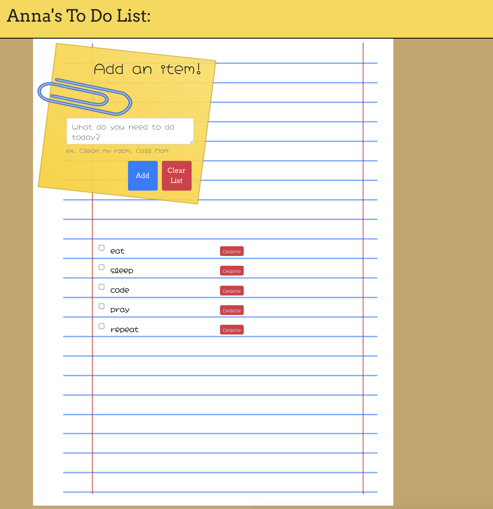

# Todo List

## Description
This repo is a notes application where you can add items to your list of things to do.
## Table of Contents
* [Installation](#installation)
* [Usage](#usage)
* [License](#license)
* [Contributing](#contributing)
* [Links](#Links)
* [Tenchnologies](#Technologies)
* [Developer](#Developers)

## Installation
npm i in react/todo
## Usage
This is a react app. You run it locally in react/todo in the terminal or bash with npm start.

It is live with GitHub Pages

## License
MIT

## Contributing
No contributors allowed

## Links
* GitHub repository URL: https://github.com/AnnaxGrace/react/tree/master/todo
* GitHub Pages Deployed URL: annaxgrace.github.io/react

## Technologies

### Languages 
* HTML, CSS, React.js

### FrameWorks
* Bootstrap React

## Developer

### Anna Conover

* Github username: annaxgrace
* Email: anna.grace.conover@gmail.com

